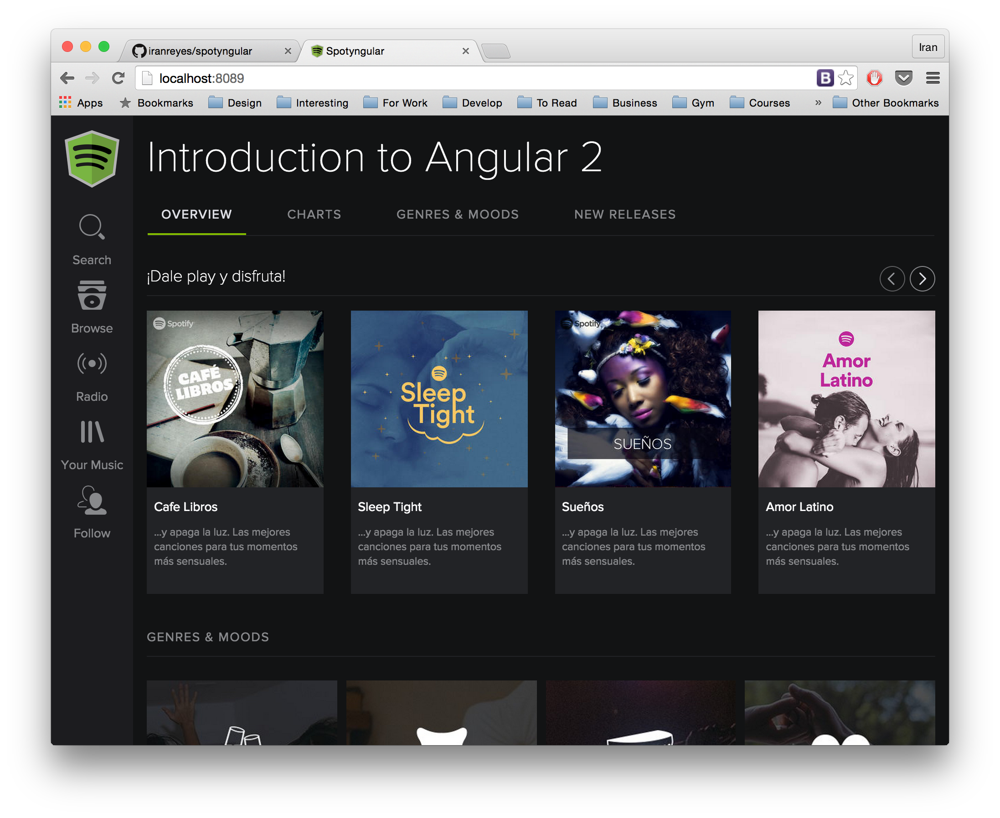

# Spotyngular
Clone of Spotify using Angular 2. The application was entire written using components and present a posible frontend architecture for future projects.

It's another demo to check and learn how many pieces of angularjs 2 features interact together.

## Features

### Globals

* Typescript
* Tsd
* NPM
* Twitter Bootstrap
* Browser-sync for server html
* json-database for server our data

### Angular 2

* SystemJS
* Use Components
* Use Directives
* Propose an architecture
* Routing
* Services for abstract the server communication
* Services for save data between routing
* Http communication
* Observables
* Component Styling(Template inline, Component inline, and style url) 
* "Large" Components Tree
* Properties
* Events
* Event bubbling
* Use of built in directives like NgFor

## How to install

Just clone the project and execute:

`npm install` to install all the npm packages

then `npm start` will start two servers, one for our database and another for the site itself.

